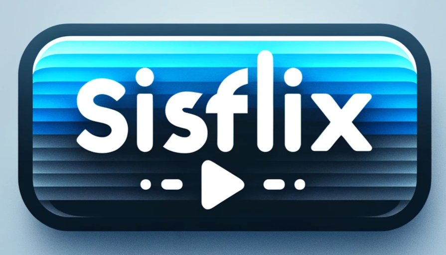
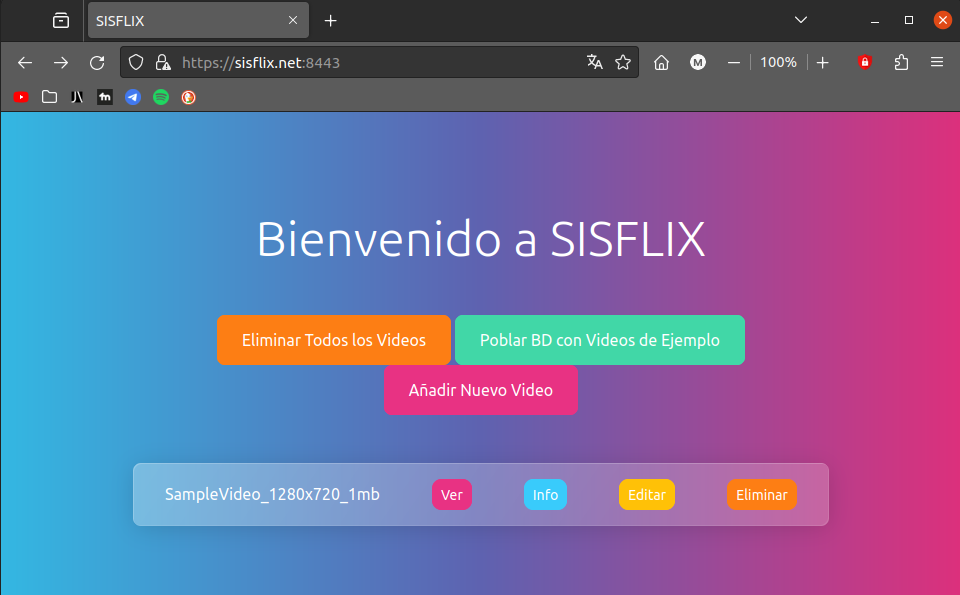
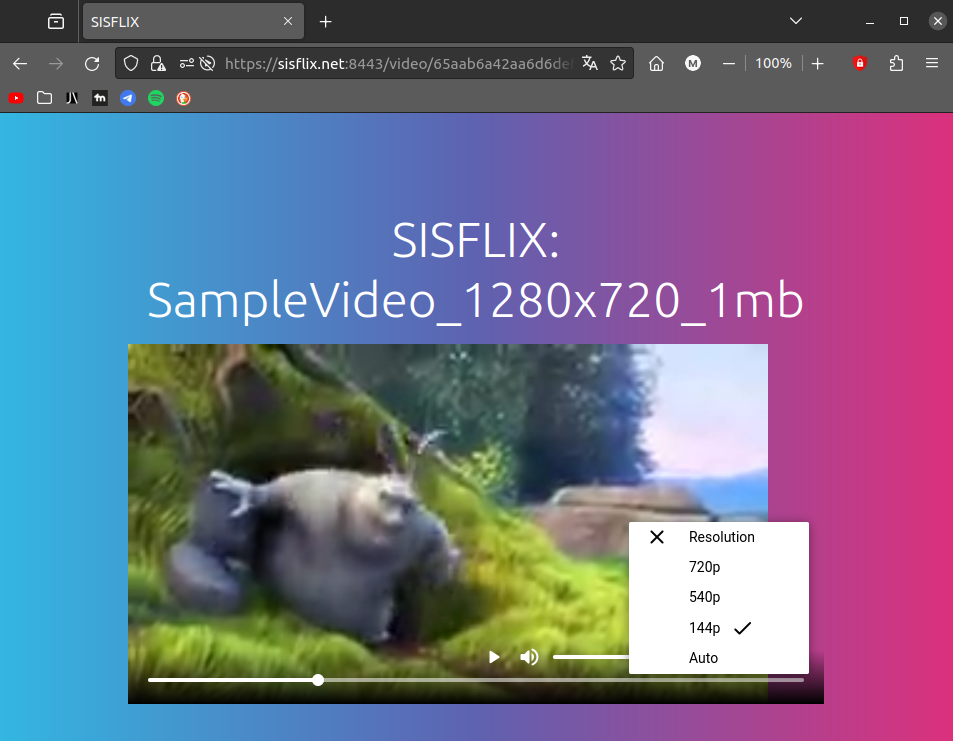

SISFLIX
=======



**SISFLIX** is a secure video-on-demand (VOD) streaming platform designed as a proof-of-concept for DRM (Digital Rights Management) technologies. It incorporates key streaming protocols and tools to demonstrate how multimedia content can be securely delivered to users while exploring the challenges and trade-offs of DRM implementations.

* * *
About the Project
-----------------

SISFLIX was born out of curiosity about content protection in streaming platforms. The project simulates a DRM-secured VOD platform, exploring the practicalities and limitations of technologies like ClearKey DRM, Shaka Packager, and HTTPS for secure delivery.

### Key Objectives:

1.  Learn and implement a DRM system.
2.  Develop a functional and modular streaming solution using Docker.
3.  Understand the practical challenges of DRM in real-world applications.

* * *
Disclaimer
-----------------

This project was originally developed and hosted on GitLab. It has been imported into this repository for archival purposes. Some configurations, references, or URLs may still point to the original GitLab repository.

For the original project and complete commit history, please visit the GitLab repository: [SISFLIX on GitLab.](https://gitlab.com/fernandodpr/smm-2324_gett)

* * *
Features
--------

*   **DRM Integration**: Uses ClearKey DRM for video encryption and playback, demonstrating the basics of content protection.
*   **Adaptive Streaming**: Supports multiple resolutions and dynamic quality changes based on network conditions.
*   **Secure Communication**: HTTPS ensures secure transmission of video and DRM licenses.
*   **User-Friendly Web Interface**: Built using Node.js for seamless navigation and ease of use.
*   **Scalable Architecture**: Dockerized microservices ensure easy deployment and scalability.
*   **Modular Design**: Includes separate services for media delivery, key management, and frontend integration.

* * *

Technologies Used
-----------------

*   **Git & GitLab**: For version control and collaborative development.
*   **Docker & Docker Compose**: For containerized deployment of services.
*   **Shaka Packager**: For video packaging and encryption.
*   **Shaka Player**: For secure video playback in the web browser.
*   **OpenSSL**: For generating SSL certificates and secure keys.
*   **MongoDB**: For storing video metadata and DRM keys.
*   **Node.js**: For frontend development and API integration.
*   **Nginx**: As a reverse proxy and lightweight web server.

* * *

Installation
------------

1.  **Prerequisites**:
    
    *   Install [Docker](https://www.docker.com/), Docker Compose, and [FFmpeg](https://ffmpeg.org/).
    *   Ensure ports `9443` and `8443` are free for the application.
2.  **Clone the Repository**:
    
    ```bash
    git clone https://gitlab.com/fernandodpr/smm-2324_gett
    cd smm-2324_gett
    ```
3.  **Start Services**:
    
    ```bash
    docker-compose up -d
    ```
4.  **Access the Platform**:
    
    *   Open your browser and navigate to:
        
        *   `https://sisflix.net:9443/` for the media server.
        *   `https://sisflix.net:8443/` for the frontend.
    *   Accept any SSL warnings caused by the self-signed certificate.
        
5.  **Stop the Application**:
    
    ```bash
    docker-compose down
    ```

* * *

Usage
-----

1.  Place videos in the `ingest` folder within the project directory.
2.  Run the media processing script to add videos to the platform:
    ```bash
    bash scriptimportarmedia.sh
    ```
3.  Refresh the frontend to view the newly added videos.

* * *

Screenshots
-----------

### Dashboard



### Video Playback (High Resolution)



* * *

Known Issues
------------

1.  **ClearKey DRM Limitations**: The use of ClearKey makes it vulnerable to key extraction via browser developer tools.
2.  **Self-Signed SSL Certificates**: The project uses self-signed certificates, which may cause browser warnings.
3.  **Limited Cross-Browser Support**: Some features may not work seamlessly on all browsers or operating systems.

* * *

Contributors
------------

This project was developed as part of a group assignment for academic purposes.

*   Martina Páramos Rial
*   Andrea Dacosta Iglesias
*   Fernando de Peroy Rodríguez

For questions or feedback, feel free to contact us.
